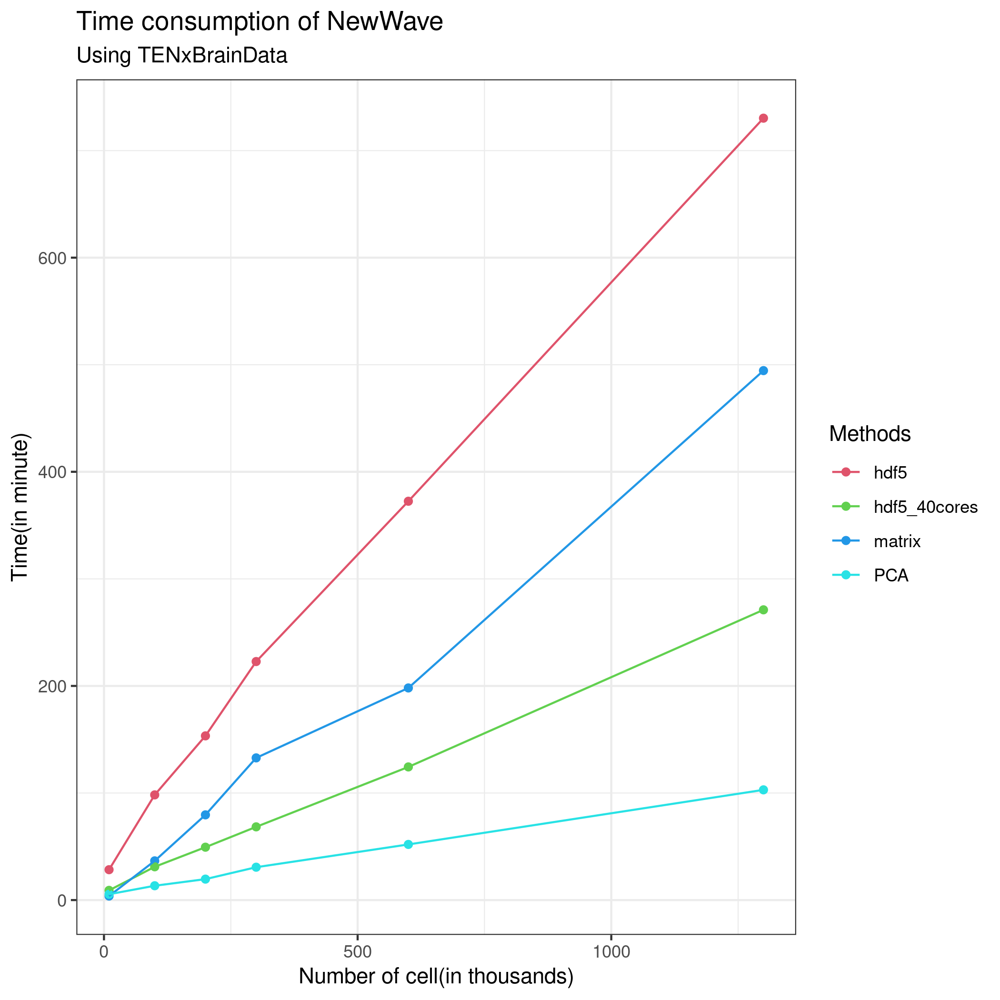
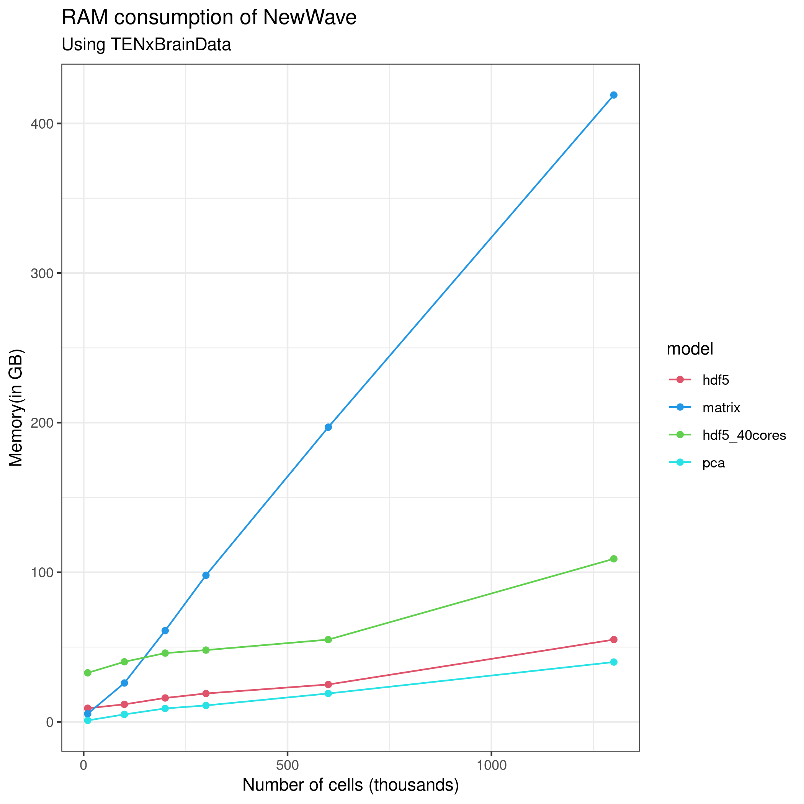

# Introduction to NewWave

Bioc 2021: 4-6 August


## Workshop Description

The fast development of single cell sequencing technologies in the recent years has generated a gap between the throughput of the experiments and the capability of analizing these generated data. 
In this package, we implement mini-batch stochastic gradient descent and a framework that allow to work with HDF5 files. We decided to use a negative binomial model following the observation that droplet sequencing technologies do not induce zero inflation in the data. Thanks to these improvements and the possibility to massively parallelize the estimation process using PSOCK clusters, we are able to speed up the computation.


### _R_ / _Bioconductor_ packages used

 * SharedObject
 * DelayedArray
 * SingleCellExperiment
 * splatter
 * TENxBrainData
 

## Workshop goals and objectives

In this workshop I am going to show how to use NewWave with different object and 
how to choose the optimal parameter related to your hardware.

# Introduction

NewWave assumes a negative binomial distribution where the mean parameter is related
to each single observation while the dispersion parameter can be equal for all
observation or related to each single gene.

$$Y_{ij} \sim NB(\mu_{ij},\theta_j)$$
And this is how the parameters are estimated:

$$\ln(\mu_{ij}) = \Big(X\beta + (V\gamma)^T + W\alpha \Big)_{ij} $$

 - $X$ represents cells related information such as batch-effect and $\beta$ the related parameters
 - $V$ represents genes level information such as GC content and $\gamma$ the related parameters
 - $W$ represent low dimensional representation and $\alpha$ is the matrix of the loadings
 
NewWave is designed for estimate $\beta$, $\gamma$,$W$ and $\alpha$ but only $W$ and $\alpha$ are mandatory, it could be used for dimensional reduction only.


$$\ln(\theta_j)   = \zeta_j$$
These are the steps used for estimate parameters :

* Initialization of regression parameters parameters using ridge regression, and low-rank rapresentation with PCA.
* Optimization of dispersion parameters, if genewise  massively parallelizable.
* Optimization of the cell-related parameters, using MLE, massively parallelizable.
* Optimization of the gene-related parameters, using MLE, massive parallelizable.

While the initialization is done only once at the beginnig of the process the other
three steps are done iteratively till convergence.

In order to reduce the memory consumption it uses a PSOCK cluster combined with the R package SharedObject that allow to share a matrix between different cores avoiding memory duplication.
Thanks to that we can massively parallelize the estimation process with huge
benefit in terms of time consumption.
We can reduce even more the time consumption using some mini batch approaches 
on the different steps of the optimization.


I am going to show how to use NewWave with example data generated with Splatter.

Splatter is a R package designed to generate single cell transcriptomic data
with a high level of customization.

In our implementation we want a batch effect to be corrected, the additionals
batch parameters are setted in order to create more complex batch effect.

You can think to the group as a cell type, we will use those group to test
the resulted low dimensional representation through a cluster analysis.

```{r}
suppressPackageStartupMessages(
  {library(SingleCellExperiment)
library(splatter)
library(irlba)
library(Rtsne)
library(ggplot2)
library(mclust)
library(NewWave)
  })
```

```{r}
params <- newSplatParams()
N=1000
data <- splatSimulateGroups(params,batchCells=c(N/2,N/2),
                           group.prob = rep(0.1,10),
                           de.prob = 0.2,
                           batch.facLoc = 2,
                           batch.facScale = 1,
                           verbose = FALSE) 
```

The resault of splatter is a SingleCellExperiment with the generated data in the assays counts.

```{r}
data
```

```{r}
class(counts(data))
```

As you can see we have the number of cell that we choose(N=1000) an 10 000 genes.
For this workshop we will choose only the 500 most variable genes.

```{r}
hvg <- rowVars(counts(data))
names(hvg) <- rownames(counts(data))
data <- data[names(sort(hvg,decreasing=TRUE))[1:500],]
```

In a SingleCellExperiment the colData slot contains the sample level metadata.
In our situation there are two important variable, Batch and Group.

```{r}
colData(data)
```

**IMPORTANT:** For batch effect removal the batch variable must be a factor

```{r}
data$Batch <- as.factor(data$Batch)
```

NewWave takes as input raw data, not normalized. So now we have all the object needed to start.

We can see the how the cells are distributed between group and batch.

```{r}
pca <- prcomp_irlba(t(counts(data)),n=10)
plot_data <-data.frame(Rtsne(pca$x)$Y)
```

```{r}
plot_data$batch <- data$Batch
plot_data$group <- data$Group
```

```{r}
ggplot(plot_data, aes(x=X1,y=X2,col=group, shape=batch))+ geom_point()
```


Just for a later comparison we can see the performance of clustering on
PCA low dimensional representation.

```{r}
cluster <- kmeans(pca$x, 10)

adjustedRandIndex(cluster$cluster, data$Group)
```
There is a clear batch effect between the cells.

Let's try to correct it.

# NewWave

I am going to show different implementation and the suggested way to use them with the given hardware.

Some basic advise:

+ Verbose option has default FALSE, in this vignette I will change it for explanatory intentions, don't do it with big dataset because it can sensibly slower the computation
+ There are no concern about the dimension of mini-batches, I always used the 10\% of the observations

## Standard usage

I am going to present the stadard implementation of NewWave, it uses 1 cores, it estimates a dispersion parameters equal for all observation and uses all the observation in the estimation process.

The K parameter represents the number of dimension of the latent rapresentation.

The X parameter is used to indicates which variable represent the batch effect,
in the same way can be inserted other cell-related variable and if you need some
gene related variable those can be inserted in V.

```{r}
res <- newWave(data, X = "~Batch", K=10, verbose = TRUE)
```

In order to make it faster you can increase the number of cores using `children`
parameter:

```{r}
res2 <- newWave(data,X = "~Batch", K=10, verbose = TRUE, children=10)
```

## Commonwise dispersion and minibatch approaches

If you do not have an high number of cores to run newWave this is the fastest way to run.
  
Each of these three steps can be accelerated using mini batch, the number of
observation is settled with these parameters:

+ n_gene_disp : Number of genes to use in the dispersion optimization
+ n_cell_par : Number of cells to use in the cells related parameters
        optimization
+ n_gene_par : Number of genes to use in the genes related parameters
        optimization

```{r}
res3 <- newWave(data,X = "~Batch", verbose = TRUE,K=10, children=10,
                n_gene_disp = 50, n_gene_par = 50, n_cell_par = 100)
```

## Genewise dispersion mini-batch

If you have a lot of core disposable or you want to estimate a genewise
dispersion parameter this is the fastest configuration:

**IMPORTANT**:do not use n_gene_disp in this case, it will slower the computation.

```{r}
res3 <- newWave(data,X = "~Batch", verbose = TRUE,K=10, children=10,
                n_gene_par = 50, n_cell_par = 100, commondispersion = FALSE)
```

This way will store the latent representation in the `reducedDim` slot.

Now I can use the latent dimension representation for visualization purpose:

```{r}
latent <- reducedDim(res3)

tsne_latent <- data.frame(Rtsne(latent)$Y)
tsne_latent$batch <- data$Batch
tsne_latent$group <- data$Group
```

```{r}
ggplot(tsne_latent, aes(x=X1,y=X2,col=group, shape=batch))+ geom_point()
```

or for clustering:

```{r}
cluster <- kmeans(latent, 10)

adjustedRandIndex(cluster$cluster, data$Group)
```

if we want to obtain more information about the model we can run `newFit` that
has exactly the same parameters

```{r}
par <- newFit(data,X = "~Batch", verbose = TRUE,K=10, children=10,
                n_gene_par = 50, n_cell_par = 100, commondispersion = FALSE)
```

The result of newFit is an object of class newmodel where are stored all the
estimated parameter seen in the introduction.

```{r}
 # View(par)
```

With this object we can also compute the AIC and the BIC of the model.

```{r}
newAIC(par, counts(data))
```

```{r}
newBIC(par, counts(data))
```


# NewWave on DelayedArray

In this package we can find a huge single cell dataset made by 1.3 M cell and 27 K genes.

Thanks to the hdf5 format that we can use trougth the DelayedArray framework this dataset is not on our RAM but it can be read and used anyway.

```{r}
suppressPackageStartupMessages(library(TENxBrainData))
```


```{r}
tenx <- TENxBrainData()
```

Let's see how is made this SingleCellExperiment

```{r}
tenx
```
It has the slot counts were the date are stored exaclty how is needed by NewWave but in this case we do not have the batch effect and so we will only reduce the dimensionality of the dataset.

Despite of the huge dimension of the dataset it's memory size is really small:

```{r}
object.size(tenx)
```
only 304 MB.

This is possible because the counts slot is not a matrix.
```{r}
class(counts(tenx))
```

In order to manage this type of file NewWave uses a set of proper method with some strength and some weakness.

I am not going to show the exact implementation but I will explain how to use NewWave in this situation and why.

The biggest strength of using DelayedArray and HDF5 files is the reduction of
the RAM consumption, the cost of that is that we read only a small piece,
called chunck, of the dataset every time and so if it is done not properly in
can strongly slower the computation especially when it is applied to an 
iterative optimization such as the one used by NewWave.

For this reason I strongly discourage to set `verbose = TRUE`, this will force
NewWave to read the dataset, chunk by chunk, several time for each iteration.

This implementation is really effective only when applied on big dataset, let's say at least 30K cell.

The are some differences with the matrix implementation:
 * there is a small approximation in the initialization
 * the estimation of the dispersion parameter is forced to be genewise
 
The best way to use NewWave in this case is the same we see before but I will not
run this code because it would be long.

```{r}
 # res4 <- newWave(tenx[1:1000,1:1000], K=10, children=2,n_gene_par = 100, n_cell_par = 100, commondispersion = FALSE, verbose=T )
```

The following figures explain the performance of NewWave in this dataset with differents approach, I have always used only the 1000 most variable genes.

```{r, echo = FALSE}

```


```{r, echo = FALSE}

```

# Reference 

The application note that describes all the results obtained comparing differents implememntation is now available on biorxiv : https://www.biorxiv.org/content/10.1101/2021.08.02.453487v1 

# Session Information

```{r}
sessionInfo()
```

